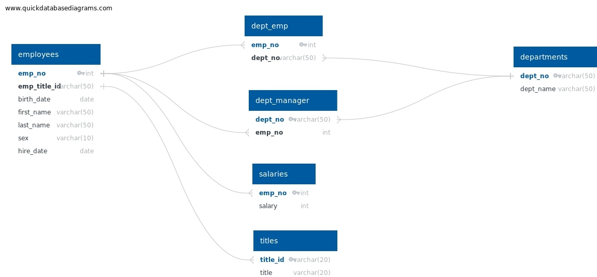
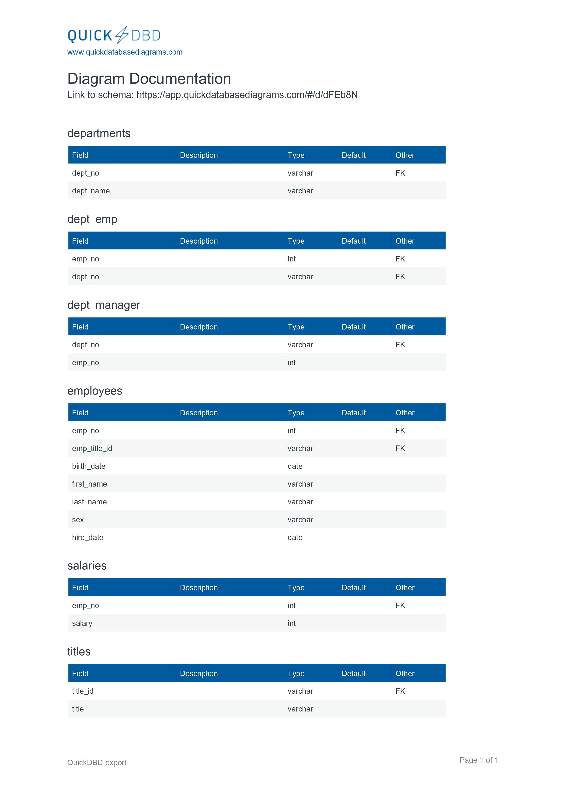

# sql-challenge
Columbia University Week 9 Challenge

## About 
The premises around this project was to design tables to hold data from CSV files, import the data that the CSV files contained into a SQL database, and use the database to query and answer the questions given to analyze the data. 

The project can be broken down in three parts: Data Modeling, Data Engineering, and Data Analysis. 

## Table of Contents
[Installation](#installation) \
[Data Modeling](#data-modeling) \
[Data Engineering](#data-engineering) \ 
[Data Analysis](#data-analysis) \
[Acknowledgements](#acknowledgements) \

## Installation 
    1. Clone repository on your local machine
    2. Open PgAdmin 4
    3. Create a New Database
    4. Open Query Tool
    5. Import 'employee_db_schema.sql' file from 'EmployeeSQL' folder
    6. Import Data from CSV files into tables (located in Data folder)
    7. Create a simple query to make sure database is setup appropiately
    8. Import 'employee_db_queries.sql' file from 'EmployeeSQL' folder
    9. Highlight and run queries one by one

## Data Modeling

## Data Engineering

## Data Analysis
**For the analysis, the queries in the "employees_db_queries.sql" file were made to satify the following requests:**
-List the employee number, last name, first name, sex, and salary of each employee.
-List the first name, last name, and hire date for the employees who were hired in 1986.
-List the manager of each department along with their department number, department name, employee number, last name, and first name.
-List the department number for each employee along with that employee’s employee number, last name, first name, and department name.
-List first name, last name, and sex of each employee whose first name is Hercules and whose last name begins with the letter B.
-List each employee in the Sales department, including their employee number, last name, and first name.
-List each employee in the Sales and Development departments, including their employee number, last name, first name, and department name.
-List the frequency counts, in descending order, of all the employee last names (that is, how many employees share each last name).
## Acknowledgements
-
-How to use Quickdbd: [How to use QuickDBD](https://www.youtube.com/watch?v=dR5lPbGLY84)
-How to Extract Year from Date in PostgreSQL: [Stackoverflow](https://stackoverflow.com/questions/36203613/how-to-extract-year-from-date-in-postgresql)
-Thank you to zaynaibg from AskBCS for helping through the year extraction from date problem
-techTFQ on SQL Joins: [Youtube](https://www.youtube.com/watch?v=0OQJDd3QqQM)
